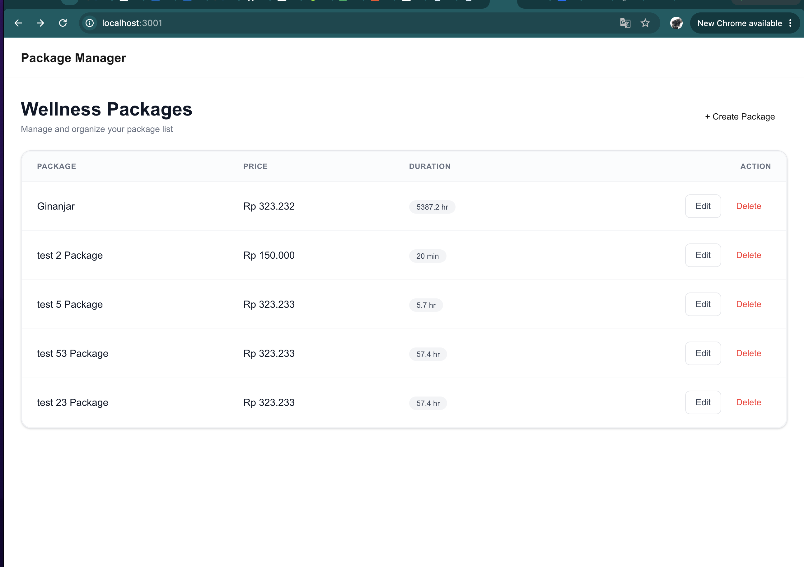
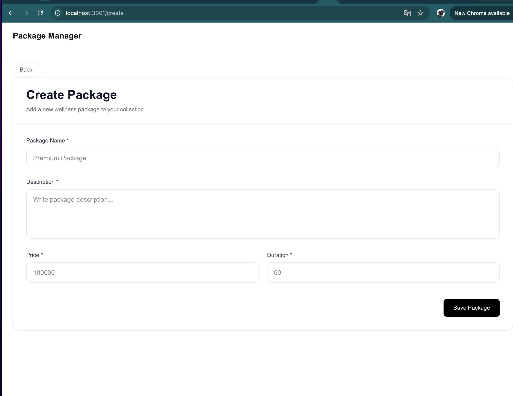
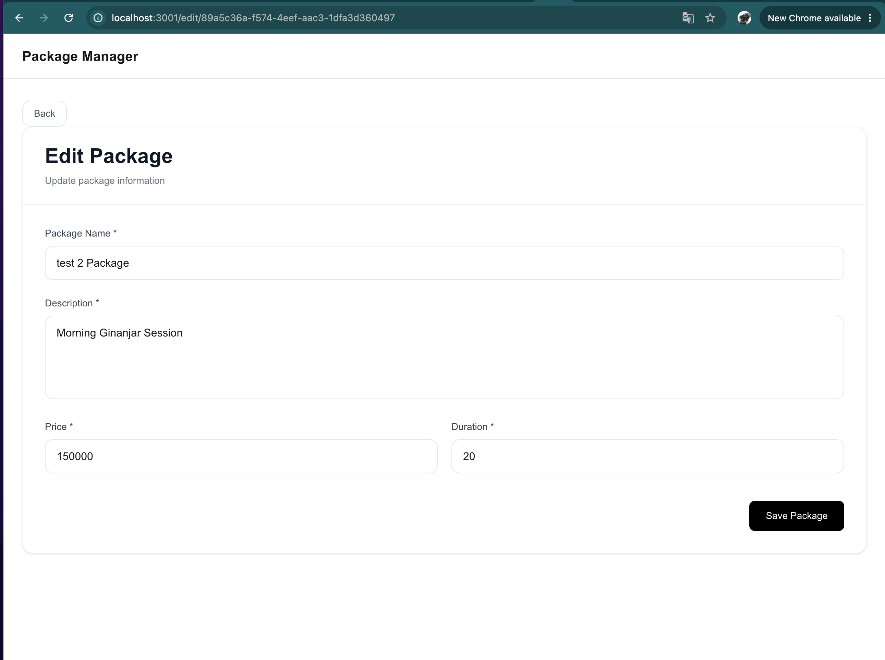
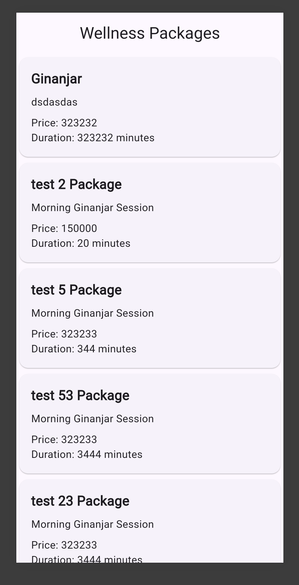
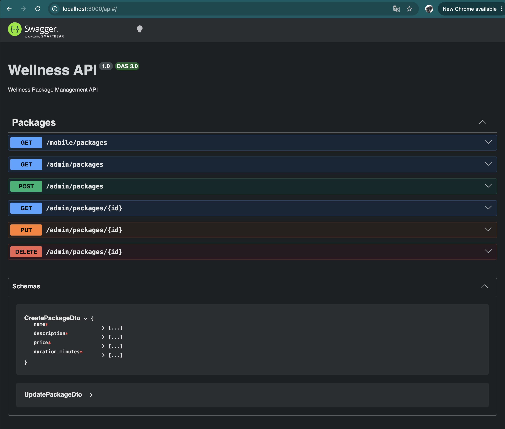
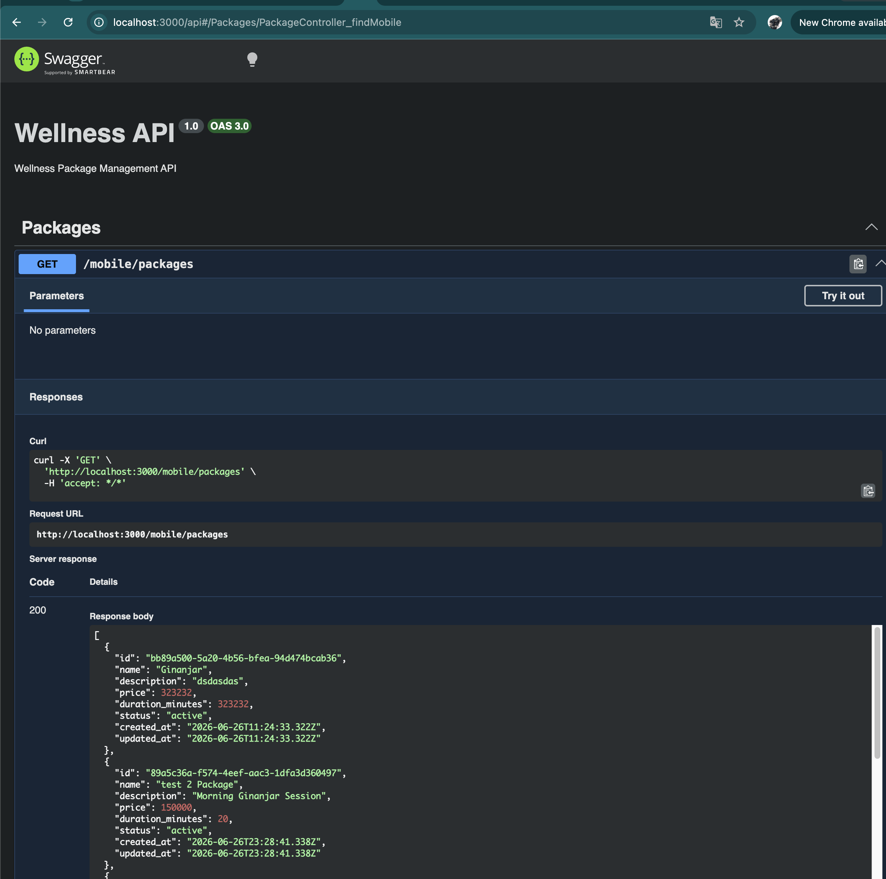

# Wellness Package Management System

A Full Stack TypeScript application for managing wellness packages built as part of a technical assessment.

## Tech Stack

### Backend

- NestJS
- TypeScript
- Prisma ORM
- SQLite
- Swagger
- Class Validator

### Admin Portal

- Next.js
- TypeScript

### Mobile App

- Flutter

---

## Project Structure

```text
wellness-system/

├── backend/
├── admin-portal/
├── mobile-app/
├── docs/
│   └── design.md
│
└── README.md
```

---

## Backend Architecture

Backend follows a simplified Clean Architecture structure:

```text
src/

├── app
│   └── controllers
│       └── package.controller.ts
│
├── domain
│   ├── entities
│   └── repositories
│
├── infrastructure
│   └── database
│       └── prisma
│
├── use-cases
│   ├── create-package
│   ├── get-packages
│   ├── update-package
│   └── delete-package
│
├── modules
│   └── package.module.ts
│
├── app.module.ts
└── main.ts
```

---

## Features

Implemented:

- Wellness package CRUD
- Mobile package listing API
- DTO validation
- Repository abstraction
- Swagger documentation
- SQLite database

Not implemented:

- Authentication
- Authorization
- Search
- Pagination
- Image upload
- Notifications

---

## API Endpoints

### Mobile API

#### Get packages

```http
GET /mobile/packages
```

Response:

```json
[
  {
    "id": "123",
    "name": "Ginanjar Package",
    "description": "Morning Ginanjar",
    "price": 150000,
    "duration_minutes": 60,
    "status": "active"
  }
]
```

---

### Admin API

#### Get all packages

```http
GET /admin/packages
```

#### Create package

```http
POST /admin/packages
```

Request:

```json
{
  "name": "Ginanjar Package",
  "description": "Morning Ginanjar",
  "price": 150000,
  "duration_minutes": 60
}
```

---

#### Update package

```http
PUT /admin/packages/:id
```

---

#### Delete package

```http
DELETE /admin/packages/:id
```

---

## Setup Backend

Navigate to backend:

```bash
cd backend
```

Install dependencies:

```bash
npm install
```

---

## Setup Database

Prisma uses SQLite.

Generate database:

```bash
npx prisma migrate dev --name init
```

Generate Prisma client:

```bash
npx prisma generate
```

---

## Run Backend

Development mode:

```bash
npm run start:dev
```

Application:

```text
http://localhost:3000
```

Swagger:

```text
http://localhost:3000/api
```

---

## Example API Testing

Create package:

```bash
curl -X POST http://localhost:3000/admin/packages \
-H "Content-Type: application/json" \
-d '{
"name":"Ginanjar Package",
"description":"Morning Ginanjar",
"price":150000,
"duration_minutes":60
}'
```

Get packages:

```bash
curl http://localhost:3000/mobile/packages
```

---

## AI Workflow

AI tools used:

- ChatGPT
- Cursor
- GitHub Copilot

AI usage:

- Architecture discussion
- Boilerplate generation
- CRUD scaffolding
- DTO generation
- Design review

Example:

Prompt:

```text
Generate a NestJS CRUD module using Prisma with Clean Architecture and repository abstraction.
```

AI was treated as an accelerator rather than an autonomous implementation tool.

---

## Future Improvements

- MySQL migration
- Authentication
- Pagination
- Unit tests
- Docker support
- CI/CD pipeline
- Logging and monitoring

---

## Screenshots

### Admin Portal





### Mobile App



### Swagger API



